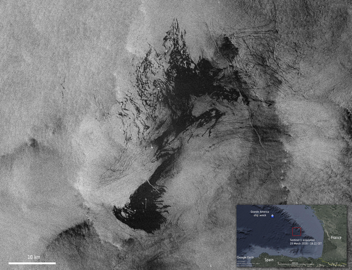
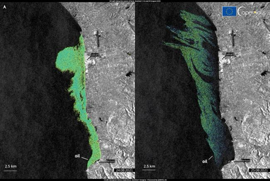
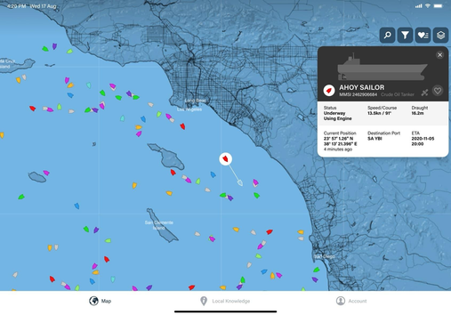
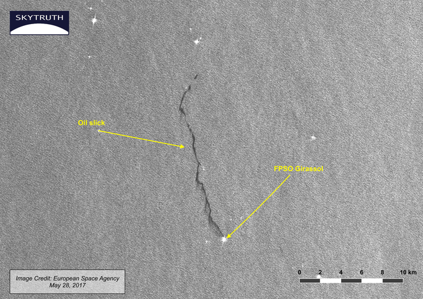

# OASIS — Oceanic Attribution & Spill Intelligence System

**Smart India Hackathon 2026 | Problem Statement SIH26143 | Team Stormtroopers (MMSIH085)**

OASIS is a maritime forensic platform that fuses satellite radar imagery, ocean drift physics, and AIS vessel-tracking data to detect oil spills at sea, reconstruct where they most likely originated, and produce a ranked, evidence-backed list of vessels that could be responsible.

This repository currently holds the problem definition, system design, and architecture for OASIS. Implementation is in progress; the sections below describe what the system is designed to do and how it is being built.

---

## Contents

- [The problem](#the-problem)
- [What OASIS does](#what-oasis-does)
- [How it works](#how-it-works)
- [Architecture](#architecture)
- [Technology stack](#technology-stack)
- [Where this differs from existing tools](#where-this-differs-from-existing-tools)
- [Known challenges and how we're addressing them](#known-challenges-and-how-were-addressing-them)
- [Who this is for](#who-this-is-for)
- [Data sources and research grounding](#data-sources-and-research-grounding)
- [Project status](#project-status)
- [Team](#team)

---

## The problem

Satellite radar can detect an oil slick on the ocean surface reasonably well. What's much harder — and what usually determines whether a polluter is ever held accountable — is tracing that slick back to the vessel that caused it. Doing this by hand means an investigator manually lining up SAR imagery, ocean current and wind data, and AIS vessel logs, then arguing a case from partial and often noisy evidence. Vessels also go dark: AIS transponders can be switched off or drop out near the time and place a spill occurs, which is exactly when the data matters most.

Existing tools stop short of closing this loop. CleanSeaNet and Cerulean, for example, detect spills and can flag vessels in the vicinity, but neither produces an end-to-end, explainable attribution — something an investigator could actually present as evidence.

## What OASIS does

Given satellite radar imagery of a suspected spill, OASIS:

1. Detects and segments the oil slick, with a confidence score rather than a binary yes/no.
2. Estimates the slick's shape, area, and approximate age.
3. Runs the slick backward through ocean current and wind data to estimate where and when it most likely originated.
4. Pulls AIS vessel traffic around that estimated origin, including vessels that had gaps in their AIS transmissions.
5. Profiles vessel behaviour — speed, heading, loitering, route deviations — to flag anything unusual.
6. Combines all of this into a ranked list of candidate vessels, with the underlying evidence for each ranking made visible rather than hidden inside a model.

## How it works

The processing pipeline moves from raw satellite data through to a shortlist of candidate vessels:

**Sentinel-1 SAR imagery** is the raw radar capture of the sea surface used to spot possible slicks.

*Sentinel-1 SAR imagery showing a spill signature at sea (dark, low-backscatter region against the surrounding sea clutter).*

**Spill detection and trajectory mapping** segments the slick from the background and models how it has moved and spread over time.

*Segmented slick boundary overlaid on SAR data, used as the starting point for backward drift modelling.*

**AIS vessel tracking** overlays vessel positions, headings, and voyage data around the estimated spill origin and time window.

*Vessel traffic in the area under investigation, pulled from AIS position reports.*

**Source identification** cross-references the drift-estimated origin against vessel tracks to narrow down and rank likely sources.

*Annotated SAR imagery linking an identified slick back to a specific vessel's recorded position.*

## Architecture

The system is organised into six layers:

**Data sources** — Sentinel-1 SAR (spill imagery), AIS (vessel position and voyage data), Copernicus Marine (ocean currents, sea state), and ERA5 (wind and weather reanalysis).

**User interface** — an investigator dashboard for overview and analytics, a GIS map for spills, drift, and vessel tracks, investigation tools for timeline and case analysis, and export/reporting.

**Frontend** — React with Vite, TypeScript, and MapLibre for the interactive map.

**Backend** — a Python/FastAPI API server handling data ingestion, preprocessing, authentication, and access control.

**AI/ML module** — PyTorch-based oil-slick segmentation and confidence estimation, vessel behaviour and anomaly detection, and the attribution scoring logic that ranks candidate vessels.

**GIS and drift modelling** — OceanParcels for drift simulation, GeoPandas and Shapely/Rasterio for spatial analysis, and forward/backward drift computation to produce the probabilistic origin region.

Detections, AIS records, model outputs, and user data are stored in MySQL. The system is containerised with Docker for deployment.

## Technology stack

| Layer | Technologies |
|---|---|
| Frontend | HTML, CSS, JavaScript, TypeScript, React, Vite |
| Mobile | React Native |
| Backend | Python, FastAPI |
| AI/ML | PyTorch, U-Net, OpenCV, NumPy, scikit-learn, PyProj |
| GIS / drift modelling | OceanParcels, GeoPandas, Shapely, Rasterio |
| Database | MySQL |
| Data sources | Sentinel-1 SAR, Copernicus Marine, AIS, ERA5 |
| Deployment | Docker |

## Where this differs from existing tools

| Existing solution | What it does | What it doesn't do |
|---|---|---|
| CleanSeaNet | Detects possible oil spills using satellite SAR and correlates them with vessel data | Limited end-to-end forensic attribution and explainable vessel ranking |
| Cerulean | Uses AI-based SAR detection and associates detected slicks with nearby AIS vessels | Limited analysis of vessel behaviour and uncertainty around spill origin |
| Academic research models | Combine satellite imagery, AIS, and ocean data for spill tracking and vessel tracing | Often scoped to a specific research task rather than a unified investigation platform |
| AIS-only analysis tools | Analyse vessel routes and anomalies | Generally not integrated with satellite-based spill evidence |

OASIS is built around a few things we think matter but are largely missing from the above:

- A probabilistic origin region rather than a single point estimate, since ocean drift is inherently uncertain.
- Vessel behaviour fingerprinting (speed, heading, loitering, deviations), not just proximity to the spill.
- Reconstruction of vessel movement through AIS gaps, since vessels often stop transmitting near the time of a spill.
- Counterfactual testing — removing a candidate vessel to see how much that changes the attribution, as a basic sanity check on the ranking.
- An evidence graph that traces each vessel's ranking back to the specific AIS and behavioural signals behind it.

## Known challenges and how we're addressing them

| Challenge | Approach |
|---|---|
| SAR look-alikes (things that resemble oil slicks but aren't) | Confidence scoring combined with contextual validation |
| Gaps in AIS coverage | Shadow-track reconstruction with an explicit uncertainty corridor |
| Uncertainty in ocean current and wind data | A multi-hypothesis drift ensemble instead of a single deterministic trajectory |
| Modelling vessel behaviour reliably | Historical behaviour fingerprinting plus anomaly detection |
| Risk of false attribution | Probabilistic ranking, intended to support human verification rather than replace it |

We're also working within some practical constraints: some maritime data sources require paid or restricted API access, and no existing tool we found offers a genuinely unified detection-to-attribution workflow — which is as much a system integration problem as a modelling one.

## Who this is for

Maritime authorities and coast guard agencies investigating a spill, environmental agencies and port authorities assessing impact, and the shipping industry itself, which has an interest in faster, fairer attribution. Coastal communities and fisheries are the ones most directly affected by spills and stand to benefit from faster detection and response.

The intended impact is straightforward: fewer unattributed spills, lower cleanup and remediation costs, and less pollution reaching coastlines and fisheries because response happens sooner.

## Data sources and research grounding

- **Sentinel-1 SAR** — primary source for oil-slick detection.
- **Sentinel-2 MSI** — optical imagery used to help confirm SAR detections and reduce false attribution.
- **AIS** — vessel positions, routes, and behavioural history.
- **Copernicus Marine** — ocean current and sea state data for drift modelling.
- **ERA5** — wind and meteorological reanalysis data.

This builds on established research showing that SAR imagery can distinguish genuine oil slicks from radar look-alikes, that SAR supports large-area spill detection and classification, and that combining SAR, AIS, and ocean data is a viable approach to spill-source investigation, including backward trajectory reconstruction using currents and wind.

## Project status

This repository currently contains the problem framing, system design, and architecture. The build is in progress. Planned work includes:

- Sentinel-1 SAR ingestion and oil-slick segmentation model
- AIS data ingestion pipeline
- Ocean current and wind drift (hindcast) modelling
- Probabilistic origin region generation
- Vessel behaviour fingerprinting and anomaly detection
- Explainable evidence graph and attribution scoring
- Investigator dashboard with GIS map
- Investigation report export
- Dockerized deployment

## Team

**Stormtroopers** — Team ID MMSIH085, Smart India Hackathon 2026.

---

*Image credits: SAR and drift imagery adapted from ESA/Copernicus Sentinel-1 data and SkyTruth, used here for illustration of the OASIS pipeline as presented in the team's SIH 2026 submission.*